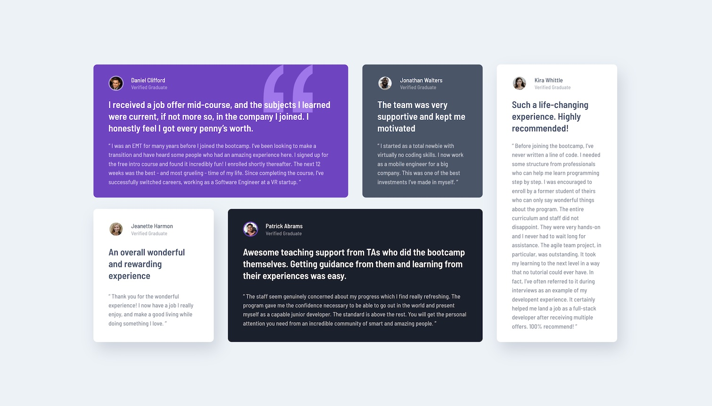

# Frontend Mentor - Testimonials grid section solution

This is my solution to the [Testimonials grid section challenge on Frontend Mentor](https://www.frontendmentor.io/challenges/testimonials-grid-section-Nnw6J7Un7). Frontend Mentor challenges help you improve your coding skills by building realistic projects. 

## Table of contents

- [Overview](#overview)
  - [The challenge](#the-challenge)
  - [Screenshot](#screenshot)
  - [Links](#links)
- [My process](#my-process)
  - [Built with](#built-with)
  - [What I learned](#what-i-learned)
  - [Continued development](#continued-development)
  - [Useful resources](#useful-resources)
- [Author](#author)
- [Acknowledgments](#acknowledgments)

**Note: Delete this note and update the table of contents based on what sections you keep.**

## Overview

### The challenge

Users should be able to:

- View the optimal layout for the site depending on their device's screen size

### Screenshot



### Links

- Solution URL: [https://github.com/jcsteltenpool/testimonials-grid-section](https://github.com/jcsteltenpool/testimonials-grid-section)
- Live Site URL: [https://jcsteltenpool.github.io/testimonials-grid-section/](https://jcsteltenpool.github.io/testimonials-grid-section/)

## My process

### Built with

- Semantic HTML5 markup
- CSS custom properties
- Flexbox
- CSS Grid
- Mobile-first workflow

### What I learned

The main challenge in this project was getting the grid for the testimonials right. For this I used `display: grid` with `grid-template-areas`:

```css
.testimonials__grid {
    display: grid;
    gap: 1.5rem 1.875rem;
    max-width: 1110px;
}

@media (min-width: 768px) {
    .testimonials__grid {
        grid-template-columns: repeat(4, 1fr);
        grid-template-rows: repeat(2, 1fr);
        grid-template-areas: 
            "one one two five"
            "three four four five";
    }

    .card_1 {grid-area: one;}  
    .card_2 {grid-area: two;}
    .card_3 {grid-area: three;}
    .card_4 {grid-area: four;}
    .card_5 {grid-area: five;}
}
```
As you can see, I also used a mobile-first workflow here.

### Continued development

The next step is to implement this use of grid sections in other websites, instead of having it as a stand-alone section.

### Useful resources

- [MDN Web Docs - Grid Template Areas](https://developer.mozilla.org/en-US/docs/Web/CSS/grid-template-areas) - My no 1 go-to resource to quickly refresh my memory about the specific syntax for things like this.


## Author

- Website - [Joost Steltenpool](https://jooststeltenpool.nl)
- Frontend Mentor - [@jcsteltenpool](https://www.frontendmentor.io/profile/jcsteltenpool)
- LinkedIn - [@jooststeltenpool](https://www.linkedin.com/in/jooststeltenpool/)


## Acknowledgments

Many thanks to Codecademy for providing me with all the fundamental knowledge, and to Kevin Powell for his awesome YouTube tips, tricks and tutorial videos.